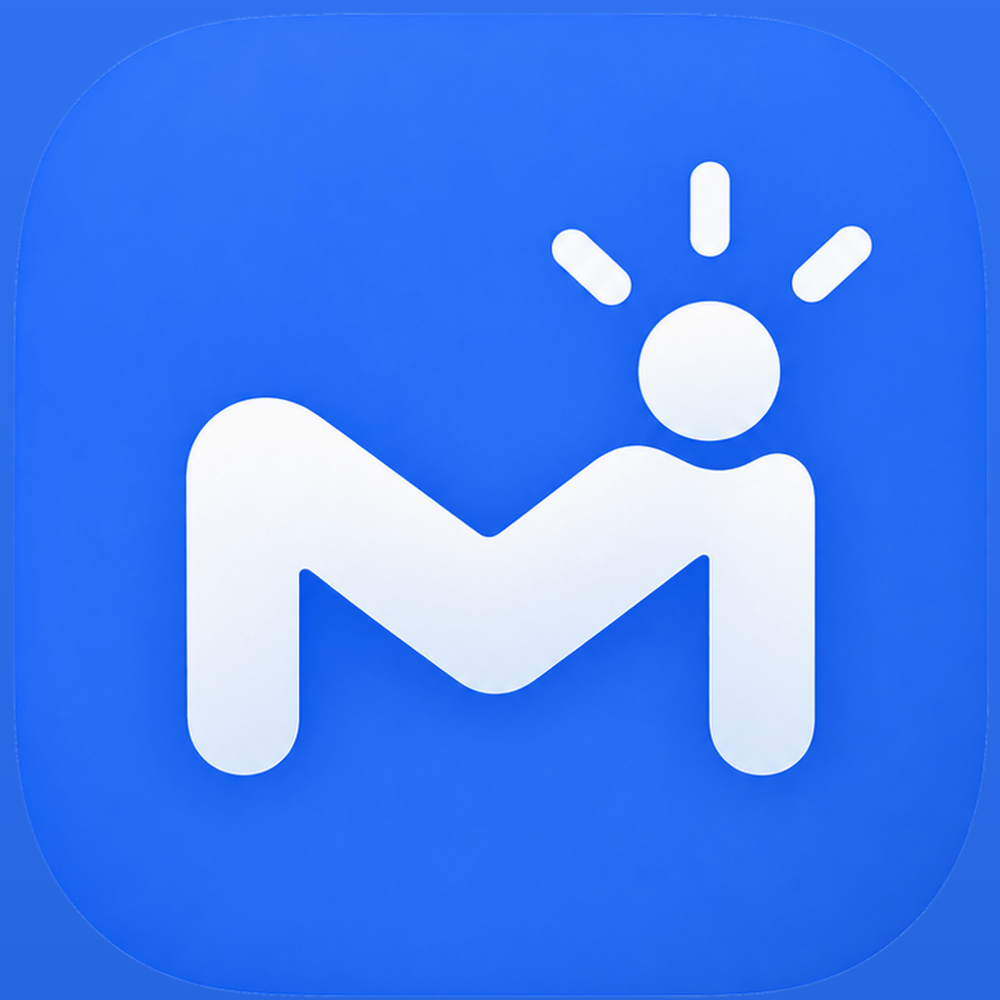

<p align="center">
  
</p>

<h1 align="center">Moldea — Habits your way!</h1>

<p align="center">
  <em>Forget habit apps that force you to follow their pace. Moldea adapts to yours.</em>
</p>

<p align="center">
  
  
  
  
</p>

<p align="center">
  <video src="https://github.com/user-attachments/assets/c1cd9a9f-fc45-4ef5-8d77-2ad45729268d" controls width="280"></video>
</p>

---

## 📱 About

Choose exactly which days you want to repeat each habit, for how long, and let the app do the
rest. With clear statistics you'll see your real progress, not empty promises. And with Siri
and AI integration, creating, adjusting, or reviewing your habits is as easy as saying it out
loud.

No rigid templates, no impossible-to-keep "perfect streaks". Moldea shapes your habits, not the
other way around.

- ✨ **Total flexibility** — you decide the days and duration
- 📊 **Statistics that actually matter** — real progress, no fluff
- 🎙️ **Siri + AI** — control your habits by talking
- 🧩 **Adapts to your life** — not the other way around

**Moldea. Because your habits are yours.**

Built for the **Apple Coding Academy Hackathon** (September 18–27), with the goal of making the
most of Apple's native SDK and being ready to publish on the App Store.

## ✨ Features

- **Habits your way** — each habit has its own repetition pattern (daily, X times a week, or
  fixed days) and its own number of repetitions per day.
- **Daily tracking** — mark each repetition from the today screen, the interactive widget, or
  the lock screen.
- **Real statistics** — per-habit progress charts with Swift Charts, no forced streaks or
  artificial metrics.
- **Local reminders** — notifications configurable per habit and per day.
- **Siri + AI voice commands** — create, delete, or review habits by voice, powered by App
  Intents and an on-device language model (Foundation Models / Apple Intelligence).
- **Widgets** — interactive home screen widget (habit checklist) and lock screen widget showing
  the day's progress.
- **Accessibility built in** — VoiceOver, Dynamic Type up to accessibility sizes, and contrast
  ≥ WCAG 2.1 throughout the app.

## 🖼️ Screenshots

<table>
  <tr>
    <td align="center"><b>Today</b></td>
    <td align="center"><b>Habits</b></td>
    <td align="center"><b>Statistics</b></td>
    <td align="center"><b>Settings</b></td>
  </tr>
  <tr>
    <td></td>
    <td></td>
    <td></td>
    <td></td>
  </tr>
</table>

## 🛠️ Tech Stack

100% native Apple SDK, no external dependencies:

- **Swift 6.4** + **SwiftUI**
- **SwiftData** — persistence
- **Swift Charts** — statistics visualization
- **App Intents** — Siri, voice commands, and interactive widget buttons
- **Foundation Models** (Apple Intelligence) — on-device interpretation of voice commands
- **UserNotifications** — local reminders
- **BackgroundTasks** — periodic reminder synchronization
- **WidgetKit** — home screen and lock screen widgets
- **App Groups** — data shared between the app and its extensions

## 🏗️ Architecture

**Modularization by feature + MVVM within each feature**, with strict Clean Architecture in the
data layer:

```
        Moldea (app target)
        ├── composes everything and is the only one that knows all of them
        │
   ┌────┴────┬──────────┬────────┬──────────┐
 Today   Statistics   Habits   Settings   Navigation
   └────────┴──────────┴────────┴──────────┘
                      │
                    Core
```

- A feature never knows about another feature; anything shared moves down to `Core`.
- Each package is organized into three layers: `Domain` (the what: entities and repository
  protocols), `Data` (the how: SwiftData, mappers), and `Presentation` (views and view models).
- SwiftData `@Model`s never cross into `Domain` as entities: they're mapped to immutable,
  `Sendable` `struct`s, keeping the domain free of persistence frameworks.
- Dependency injection through the environment (`@Entry`), one container per package, composed
  once in `MoldeaApp`.
- Two-level navigation with `@Observable` routers (`AppRouter`, `TabRouter`), independent of the
  features.

The full detail behind each decision lives in the repository's [`CLAUDE.md`](CLAUDE.md), and
each package has its own with the specifics of that module.

## 📂 Project Structure

```
Moldea/
├── Moldea.xcodeproj
├── Moldea/                    # app target
│   ├── MoldeaApp.swift        # @main: ModelContainer, DI and navigation
│   ├── DI/AppDependencies.swift
│   └── Package/                # local packages (Swift Packages)
│       ├── Core/                # shared domain, persistence, Core use cases
│       ├── Navigation/          # routers and navigation containers
│       ├── Today/                # today screen
│       ├── Statistics/           # statistics and charts
│       ├── Habits/               # habit creation, editing, and listing
│       └── Settings/             # app settings
├── TodayProgressWidget/        # lock screen widget
├── QuickHabitCheckWidget/       # interactive home screen widget
├── MoldeaTests/
└── MoldeaUITests/
```

## ⚙️ Requirements

- Xcode with the **iOS 26** SDK
- Simulator or device running **iOS 26** (the packages set `platforms: [.iOS(.v26)]`)
- Swift **6.4**

## 🚀 Getting Started

```bash
git clone <repo-url>
cd Moldea
open Moldea.xcodeproj
```

1. Select the `Moldea` scheme.
2. Pick a destination running **iOS 26.x** (`xcodebuild -showdestinations -scheme Moldea` to
   see the available ones).
3. Build and run with `⌘R`.

## 🔐 Configuration

- The app and the widgets share data through an **App Group**; make sure the App Group
  identifier matches across the entitlements of `Moldea`, `TodayProgressWidget`, and
  `QuickHabitCheckWidget`.
- Local notifications require the user to grant permission from `Settings` the first time a
  reminder is scheduled.
- Using the microphone and Apple Intelligence voice commands requires speech recognition
  authorization, requested the first time the microphone button is used.

## 🧪 Testing

- **Swift Testing** (`import Testing`, `@Test`, `#expect`) for domain logic, use cases, and view
  models — each package brings its own test target.
- **XCUIAutomation** for UI tests (`MoldeaUITests`).
- Persistence tests use `MoldeaSchema.makeModelContainer(inMemory: true)` to avoid touching
  real data.

```bash
xcodebuild test -scheme Moldea -destination 'platform=iOS Simulator,name=<simulator with iOS 26>'
```

## 🔒 Privacy

- All habit, statistics, and reminder data is stored **locally** with SwiftData; there's no
  backend or remote sync.
- Voice commands are interpreted **on-device** with Foundation Models (Apple Intelligence):
  audio and text never leave the device.
- Notifications are local (`UserNotifications`), not remote push.

## 🤝 Contributing

Project built for the Apple Coding Academy Hackathon. Before touching a package, read its
`CLAUDE.md`; the architecture, naming, and accessibility conventions are described there.

## 📄 License

No license defined yet.

## 👤 Author

**Ismael Cordón Domínguez**
**Andrés Cordón Domínguez**
